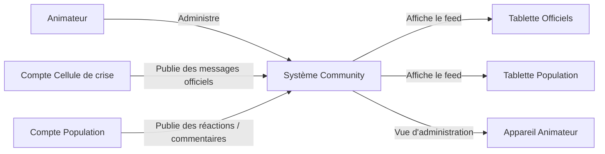
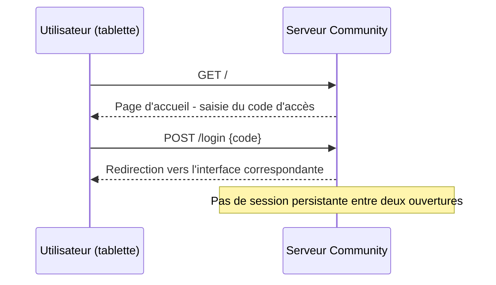
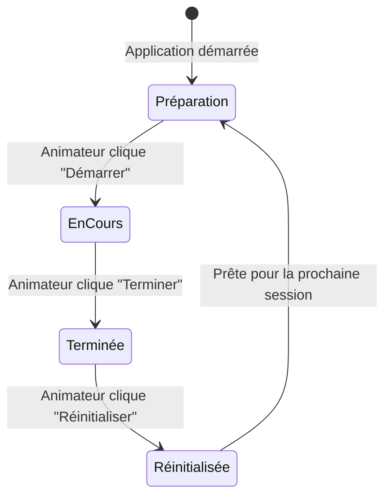

# Spécifications fonctionnelles — Community

> **Version** : 1.0  
> **Date** : 14 avril 2026  
> **Projet** : Community  
> **Auteur** : Punk-04 (GitHub Copilot)  
> **Statut** : Brouillon

---

## Table des matières

1. [Acteurs du système](#1-acteurs-du-système)
2. [Authentification et contrôle d'accès](#2-authentification-et-contrôle-daccès)
3. [Module Animateur (back-office)](#3-module-animateur-back-office)
4. [Module Cellule de crise](#4-module-cellule-de-crise)
5. [Module Population](#5-module-population)
6. [Feed en temps réel](#6-feed-en-temps-réel)
7. [Photothèque intégrée](#7-photothèque-intégrée)
8. [Gestion de session](#8-gestion-de-session)
9. [Règles de gestion transverses](#9-règles-de-gestion-transverses)
10. [Maquettes conceptuelles](#10-maquettes-conceptuelles)

---

## 1. Acteurs du système



| Acteur | Description | Nb de comptes |
|---|---|---|
| **Animateur** | Gère la photothèque, configure les codes d'accès, démarre/arrête/réinitialise la session, définit l'heure fictive | 1 (compte admin) |
| **Cellule de crise** | Diffuse des alertes et informations officielles, programme ses messages à l'avance | 1 compte partagé |
| **Population** | Envoie des messages libres, commente | 1 compte partagé |

> **Note** : Dans le cadre de l'atelier, plusieurs élèves peuvent utiliser le même compte partagé depuis des tablettes différentes. Les messages sont affichés chronologiquement sans attribution individuelle.

---

## 2. Authentification et contrôle d'accès

### 2.1 Mécanisme d'accès

L'animateur génère ou configure, avant la session, **deux codes d'accès** :

| Compte | Code | Permissions |
|---|---|---|
| `cellule-de-crise` | Code A (ex. `MAIRIE2026`) | Publier et programmer des messages officiels, accéder à la photothèque |
| `population` | Code B (ex. `CITOYEN2026`) | Publier des messages libres, commenter |
| `animateur` | Code admin | Accès back-office (gestion photothèque/scénarios, sélection dossier actif, codes, gestion session) |

### 2.2 Cinématique de connexion



### 2.3 Règles

- Un code invalide retourne un message d'erreur explicite.
- Aucune création de compte par les participants.
- Le code de l'animateur n'est **jamais** distribué aux participants.

---

## 3. Module Animateur (back-office)

### 3.1 Vue d'ensemble du back-office

L'animateur dispose d'une interface dédiée accessible à `/admin` après authentification.

### 3.2 Fonctionnalités

#### F-ADMIN-01 — Préparation des messages programmés

| Champ | Type | Obligatoire |
|---|---|---|
| Contenu textuel | Texte long | Oui |
| Photo (optionnelle) | Sélection depuis photothèque | Non |
| Délai de publication | Durée en minutes depuis le début de session OU heure fixe | Oui |
| Ordre d'affichage | Entier (priorité en cas de conflit) | Non |

- L'animateur clique sur **"Programmer"** pour enregistrer un message dans la file d'attente.
- Les messages programmés sont listés dans un tableau ordonnés par heure de publication prévue.
- Chaque message peut être modifié ou supprimé avant le démarrage de la session.

#### F-ADMIN-02 — Démarrage de session

- Bouton **"Démarrer la session"** : active le chronomètre interne et commence à envoyer les messages programmés aux moments définis.
- À partir de ce moment, l'animateur peut aussi envoyer des messages officiels **en temps réel** (hors programmation).

#### F-ADMIN-03 — Gestion en cours de session

- Visualisation du feed des deux groupes dans une vue côte à côte.
- Possibilité de publier un message officiel ad hoc (sans programmation préalable).

#### F-ADMIN-04 — Arrêt et réinitialisation

- Bouton **"Terminer la session"** : stoppe la session.
- Bouton **"Réinitialiser"** : supprime **tous** les messages et commentaires de la session courante (action irréversible, confirmation demandée).

---

## 4. Module Cellule de crise

### 4.1 Feed officiel

L'interface affiche un fil d'actualité de style réseau social présentant uniquement les messages publiés par la cellule de crise.

### 4.2 Fonctionnalités

#### F-CRISE-01 — Publication en temps réel

| Champ | Type | Obligatoire |
|---|---|---|
| Contenu textuel | Texte (max. 280 caractères recommandé) | Oui |
| Photo (optionnelle) | Sélection depuis photothèque | Non |

- Un bouton **"Publier"** soumet le message immédiatement.
- Le message apparaît en tête du feed avec l'horodatage **fictif** courant.

#### F-CRISE-02 — Programmation d'un message

| Champ | Type | Obligatoire |
|---|---|---|
| Contenu textuel | Texte (max. 280 caractères recommandé) | Oui |
| Photo (optionnelle) | Sélection depuis photothèque | Non |
| Heure fictive de publication | Heure au format HH:MM (doit être postérieure à l'heure fictive actuelle) | Oui |

- Un bouton **« Programmer »** (distinct de « Publier ») enregistre le message dans la file d'attente.
- Le message sera automatiquement publié dans le feed lorsque l'horloge fictive atteindra l'heure programmée.
- Les messages programmés sont visibles dans une liste sous le formulaire de rédaction, avec leur heure prévue.
- Un message programmé peut être supprimé avant sa publication.

#### F-CRISE-03 — Réception des messages de la population et réponse

- Le feed de la cellule de crise affiche **en lecture seule** les messages de la population dans un panneau latéral ou une section dédiée.
- La cellule de crise peut **répondre** à n'importe quel message de la population via un bouton « Répondre ».
- La réponse est affichée indentée sous le message parent, avec l'horodatage fictif et un badge distinctif « Officiel ».

#### F-CRISE-04 — Messages programmés (publication automatique)

- Les messages programmés par la cellule de crise s'insèrent automatiquement dans le feed lorsque l'horloge fictive atteint l'heure définie.
- Ils sont visuellement identiques aux messages publiés en temps réel (pas de distinction visible pour les participants).

---

## 5. Module Population

### 5.1 Feed population

L'interface affiche un fil d'actualité de style réseau social présentant l'ensemble des messages publiés par la population, ainsi que les **alertes officielles de la cellule de crise** intégrées dans le flux.

### 5.2 Fonctionnalités

#### F-POP-01 — Publication d'un message

| Champ | Type | Obligatoire |
|---|---|---|
| Contenu textuel | Texte libre (max. 280 caractères recommandé) | Oui |

- Un bouton **"Publier"** soumet le message.
- Le message apparaît dans le feed commun avec horodatage.

#### F-POP-02 — Réponse à un message

- Chaque message du feed (citoyen **ou officiel**) dispose d'un bouton **« Répondre »**.
- Un champ de saisie apparaît sous le message.
- La réponse est affichée indentée sous le message parent, avec l'horodatage fictif.
- Une réponse à un message officiel est affichée avec un label « Citoyen » pour la distinguer.

#### F-POP-03 — Affichage des messages officiels

- Les messages de la cellule de crise apparaissent dans le feed de la population avec une **mise en forme visuelle distincte** (badge, couleur, icône officielle) pour les différencier des messages citoyens.

---

## 6. Feed en temps réel

### 6.1 Mécanisme de mise à jour

- Le feed est mis à jour **automatiquement** sans rechargement de page via **HTMX polling** (toutes les 2 secondes).
- Latence cible : < 3 secondes.

### 6.2 Tri et affichage

- Messages affichés en **ordre chronologique inverse** (plus récent en haut), conformément aux standards des réseaux sociaux.
- Horodatage affiché en heure **fictive** (ex. `09:14`) définie par l'animateur, **jamais l'heure réelle du système**.
- L'**heure fictive courante** est affichée en permanence en haut de chaque interface (admin et participants), visible par tous.

### 6.3 Différenciation visuelle des messages

| Type de message | Style visuel |
|---|---|
| Message officiel (cellule de crise) | Fond coloré distinctif (ex. bleu institutionnel), badge "Officiel", avatar mairie |
| Message population | Style post standard, avatar générique |
| Commentaire | Indenté, police réduite, trait de connexion au message parent |

---

## 7. Photothèque intégrée

### 7.1 Description

La photothèque est **persistante** : elle est conservée entre toutes les sessions et n'est **jamais effacée** lors d'une réinitialisation.

Les images sont organisées en **dossiers thématiques**, chacun correspondant à un scénario de simulation (ex. `inondation`, `incendie`, `epidemie`). Ces dossiers sont stockés sur le système de fichiers de la Raspberry Pi.

Avant chaque session, l'animateur sélectionne le **dossier actif** : seules les photos de ce dossier sont accessibles à la cellule de crise pendant la simulation.

### 7.2 Fonctionnalités

#### F-PHOTO-01 — Sélection d'une photo lors de la rédaction

- Lors de la rédaction d'un message **côté cellule de crise**, un bouton **« Ajouter une photo »** ouvre la galerie du **dossier actif** uniquement.
- L'utilisateur sélectionne une image ; elle est attachée au message.

#### F-PHOTO-02 — Gestion des dossiers et des photos (admin)

- L'animateur peut créer un nouveau dossier de scénario (nom libre).
- L'animateur peut importer des photos dans n'importe quel dossier.
- L'animateur peut supprimer une photo d'un dossier.
- Formats acceptés : JPG, PNG, WebP.
- Taille maximale recommandée par image : 2 Mo.

#### F-PHOTO-03 — Sélection du dossier actif (admin)

- Dans l'interface de configuration de session, l'animateur choisit le **dossier de scénario actif** parmi la liste des dossiers existants.
- Le dossier actif est mémorisé dans la configuration de session et reste sélectionné jusqu'à modification manuelle.
- Avant démarrage de session, si aucun dossier actif n'est sélectionné, un avertissement est affiché à l'animateur.

---

## 8. Gestion de session

### 8.1 Cycle de vie d'une session



### 8.2 Règles

- Une seule session peut être active à la fois.
- Le démarrage de session active l'horloge fictive et déclenche la surveillance des messages programmés.
- La réinitialisation est **manuelle** : elle est déclenchée par l'animateur via un bouton dédié dans son interface.
- La réinitialisation supprime : messages, commentaires, et remet l'horloge fictive à zéro.
- Les codes d'accès, la photothèque (tous les dossiers et toutes les photos), les messages programmés et le dossier actif sélectionné sont **conservés** après réinitialisation.

---

## 9. Règles de gestion transverses

| ID | Règle |
|---|---|
| RG-01 | Un message vide (texte nul sans photo) ne peut pas être publié. |
| RG-02 | Les messages programmés ne sont publiés que si la session est en cours et que l'horloge fictive a atteint leur heure de programmation. |
| RG-03 | La réinitialisation requiert une confirmation explicite de l'animateur. |
| RG-04 | Le compte population ne peut pas accéder au back-office admin. |
| RG-05 | Les deux groupes (cellule de crise et population) peuvent répondre aux messages de l'autre groupe. |
| RG-06 | Les données de session sont stockées en base de données locale (SQLite) et effacées lors de la réinitialisation manuelle. |
| RG-07 | L'application doit être opérationnelle sans connexion internet. |
| RG-08 | L'horodatage affiché dans les feeds est toujours celui de l'horloge fictive, jamais l'heure réelle du système. |
| RG-09 | Seul le compte cellule de crise peut programmer des messages ; le compte animateur n'a pas accès à la rédaction. |
| RG-10 | Un message publié ne peut **pas être modifié** après publication. |
| RG-11 | Les messages de la population n'ont pas de pseudonyme individuel ; ils sont tous affichés sous le label générique « Citoyen ». |

---

## 10. Maquettes conceptuelles

### 10.1 Interface Population (feed)

```
┌─────────────────────────────────────────────┐
│  🏛️  ALERTE OFFICIELLE          14:02       │
│  Évacuation obligatoire du quartier Nord.    │
│  [Photo : carte d'évacuation.jpg]           │
└─────────────────────────────────────────────┘
┌─────────────────────────────────────────────┐
│  👤  Citoyen                    14:05       │
│  Est-ce que quelqu'un a des nouvelles de    │
│  la rue de la Paix ?                        │
│  💬 Commenter (2)                           │
│    ↳ Ça semble bloqué côté pont — 14:06    │
└─────────────────────────────────────────────┘
┌─────────────────────────────────────────────┐
│ ┌─────────────────────────────────────────┐ │
│ │ Votre message...                        │ │
│ └─────────────────────────────────────────┘ │
│                              [  Publier  ]  │
└─────────────────────────────────────────────┘
```

### 10.2 Interface Cellule de crise

```
┌── 🕒 09:14  COMMUNITY ───────────────────────────┐
│  [Heure fictive courante affichée en permanence]      │
├─ RÉDACTION ─────────────────────────────────────────┤
│ ┌──────────────────────────────────[📷 Photo]┐ │
│ │ Texte...                                        │ │
│ └─────────────────────────────────────────────┘ │
│             [Programmer à HH:MM]   [Publier]         │
├─ FIL OFFICIEL ─────── | ─ MESSAGES POPULATION ───┤
│ 09:02 — Évacuation quartier Nord │ 09:05 — Citoyen    │
│    ↳ [Citoyen] C'est par quel  │   Des nouvelles de  │
│        chemin ? — 09:06         │   la rue de la Paix?│
│ 💬 Répondre                      │ 💬 Répondre (2)      │
└─────────────────────────────────────────────────────┘
```

---

## Points ouverts

> Tous les points ouverts ont été résolus. Aucune question en attente.
