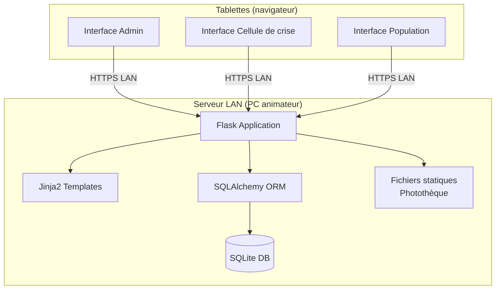

# Spécifications techniques — Community

> **Version** : 1.0  
> **Date** : 14 avril 2026  
> **Projet** : Community  
> **Auteur** : Punk-04 (GitHub Copilot)  
> **Statut** : Brouillon

---

## Table des matières

1. [Stack technique](#1-stack-technique)
2. [Architecture applicative](#2-architecture-applicative)
3. [Modèle de données](#3-modèle-de-données)
4. [Structure du projet](#4-structure-du-projet)
5. [API interne — Routes Flask](#5-api-interne--routes-flask)
6. [Mise à jour en temps réel](#6-mise-à-jour-en-temps-réel)
7. [Authentification et sécurité](#7-authentification-et-sécurité)
8. [Gestion des médias](#8-gestion-des-médias)
9. [Déploiement local (LAN)](#9-déploiement-local-lan)
10. [Contraintes de performance](#10-contraintes-de-performance)

---

## 1. Stack technique

| Couche | Technologie | Justification |
|---|---|---|
| **Backend** | Python 3.11+ / Flask 3.x | Légèreté, simplicité, déploiement offline |
| **Base de données** | SQLite (via SQLAlchemy ORM) | Embarquée, zéro configuration, adaptée au LAN |
| **Frontend** | HTML5 / CSS3 / **HTMX** | Mise à jour partielle du feed sans framework JS lourd, compatible tablette |
| **Mise à jour temps réel** | HTMX polling (`hx-trigger="every 2s"`) | Simple à implémenter, pas de JS supplémentaire à écrire |
| **Templating** | Jinja2 (inclus dans Flask) | Standard Flask, compatible fragments HTMX |
| **Serveur de production** | Waitress | Stable, multi-threadé, adapté Raspberry Pi |
| **TLS** | Certificat auto-signé (openssl) | HTTPS sur LAN, requis pour certaines API navigateur sur tablette |

---

## 2. Architecture applicative



### Principe de déploiement

- Le serveur Flask est lancé sur la **Raspberry Pi**.
- Les tablettes se connectent via l'**IP locale** de la Pi (ex. `https://192.168.1.10:5000`).
- Un certificat TLS **auto-signé** est généré une fois sur la Pi et configuré dans Waitress.
- Les tablettes devront accepter manuellement le certificat lors de la première connexion (avertissement navigateur normal).
- Aucune connexion internet n'est requise.

---

## 3. Modèle de données

### 3.1 Diagramme Entité-Relation

```mermaid
erDiagram
    SESSION {
        int id PK
        datetime started_at
        datetime ended_at
        bool is_active
    }

    MESSAGE {
        int id PK
        int session_id FK
        string role
        string content
        string photo_filename
        datetime published_at
        bool is_scheduled
        datetime scheduled_for
        bool is_published
    }

    COMMENT {
        int id PK
        int message_id FK
        string content
        datetime created_at
    }

    PHOTO {
        int id PK
        string scenario_folder
        string filename
        string original_name
        datetime uploaded_at
    }

    CONFIG {
        string key PK
        string value
    }

    SESSION ||--o{ MESSAGE : "contient"
    MESSAGE ||--o{ COMMENT : "reçoit"
```



### 3.2 Description des entités

#### Table `session`

| Colonne | Type | Description |
|---|---|---|
| `id` | INTEGER PK | Identifiant auto-incrémenté |
| `started_at` | DATETIME | Heure de démarrage de la session |
| `ended_at` | DATETIME | Heure de fin (NULL si en cours) |
| `is_active` | BOOLEAN | True si la session est en cours |

#### Table `message`

| Colonne | Type | Description |
|---|---|---|
| `id` | INTEGER PK | Identifiant auto-incrémenté |
| `session_id` | INTEGER FK | Référence à la session courante |
| `role` | VARCHAR(20) | `officiel` ou `population` |
| `content` | TEXT | Contenu textuel du message |
| `photo_filename` | VARCHAR(255) | Nom du fichier image attaché (NULL si absent) |
| `published_at` | DATETIME | Heure effective de publication |
| `is_scheduled` | BOOLEAN | True si le message était programmé |
| `scheduled_for` | DATETIME | Heure cible de publication programmée (NULL si message direct) |
| `is_published` | BOOLEAN | False si programmé mais pas encore publié |

#### Table `comment`

| Colonne | Type | Description |
|---|---|---|
| `id` | INTEGER PK | Identifiant auto-incrémenté |
| `message_id` | INTEGER FK | Message parent |
| `content` | TEXT | Contenu du commentaire |
| `created_at` | DATETIME | Heure de création |

#### Table `photo`

| Colonne | Type | Description |
|---|---|---|
| `id` | INTEGER PK | Identifiant auto-incrémenté |
| `scenario_folder` | VARCHAR(255) | Nom du dossier de scénario parent |
| `filename` | VARCHAR(255) | Nom du fichier sur disque (slug sécurisé) |
| `original_name` | VARCHAR(255) | Nom d'origine du fichier importé |
| `uploaded_at` | DATETIME | Date d'import |

> La table `photo` est **persistante** : elle n'est jamais vidée lors de la réinitialisation d'une session.

#### Table `config`

Clé/valeur pour les paramètres de l'application :

| Clé | Valeur exemple | Description |
|---|---|---|
| `code_officiel` | `MAIRIE2026` | Code d'accès cellule de crise |
| `code_population` | `CITOYEN2026` | Code d'accès population |
| `code_admin` | hash bcrypt | Code d'accès animateur (stocké hashé) |
| `scenario_actif` | `inondation` | Nom du dossier de photothèque sélectionné pour la session courante |

---

## 4. Structure du projet

```
community/
├── app/
│   ├── __init__.py            # Factory Flask (create_app)
│   ├── models.py              # Modèles SQLAlchemy
│   ├── routes/
│   │   ├── auth.py            # Login / logout
│   │   ├── admin.py           # Back-office animateur
│   │   ├── officiel.py        # Interface cellule de crise
│   │   ├── population.py      # Interface population
│   │   └── api.py             # Endpoints JSON (polling feed)
│   ├── templates/
│   │   ├── base.html
│   │   ├── login.html
│   │   ├── admin/
│   │   │   ├── dashboard.html
│   │   │   └── photos.html
│   │   ├── officiel/
│   │   │   └── feed.html      # Page unique : feed + zone rédaction
│   │   ├── population/
│   │   │   └── feed.html      # Page unique : feed + zone rédaction
│   │   └── partials/
│   │       ├── message_card.html   # Fragment HTMX : carte message
│   │       ├── feed_officiel.html  # Fragment HTMX : liste messages officiels
│   │       └── feed_population.html # Fragment HTMX : liste messages population
│   ├── static/
│   │   ├── css/
│   │   │   └── styles.css
│   │   ├── js/
│   │   │   └── htmx.min.js        # HTMX (fichier local, pas de CDN)
│   │   └── photos/            # Photothèque persistante
│   │       ├── inondation/    # Un dossier par scénario
│   │       ├── incendie/
│   │       └── epidemie/
│   └── utils/
│       └── scheduler.py       # Publication des messages programmés
├── instance/
│   └── community.db           # Base SQLite (hors versioning)
├── config.py                  # Configuration Flask
├── run.py                     # Point d'entrée
└── requirements.txt
```

---

## 5. API interne — Routes Flask

### 5.1 Authentification

| Méthode | Route | Description |
|---|---|---|
| `GET` | `/` | Redirection vers `/login` |
| `GET/POST` | `/login` | Formulaire de connexion |
| `GET` | `/logout` | Déconnexion et retour à `/login` |

### 5.2 Back-office Animateur

| Méthode | Route | Description |
|---|---|---|
| `GET` | `/admin` | Tableau de bord admin |
| `POST` | `/admin/message/schedule` | Programmer un message officiel |
| `POST` | `/admin/message/publish` | Publier un message officiel immédiatement |
| `DELETE` | `/admin/message/<id>` | Supprimer un message programmé |
| `POST` | `/admin/session/start` | Démarrer la session |
| `POST` | `/admin/session/stop` | Terminer la session |
| `POST` | `/admin/session/reset` | Réinitialiser toutes les données de session |
| `GET` | `/admin/photos` | Liste des dossiers de scénario |
| `POST` | `/admin/photos/folder` | Créer un nouveau dossier de scénario |
| `POST` | `/admin/photos/<folder>/upload` | Importer une photo dans un dossier |
| `DELETE` | `/admin/photos/<folder>/<id>` | Supprimer une photo d'un dossier |
| `POST` | `/admin/photos/actif` | Définir le dossier actif pour la session |
| `POST` | `/admin/config` | Modifier les codes d'accès |

### 5.3 Interface Cellule de crise

| Méthode | Route | Description |
|---|---|---|
| `GET` | `/officiel` | Feed officiel |
| `POST` | `/officiel/message` | Publier un message officiel |

### 5.4 Interface Population

| Méthode | Route | Description |
|---|---|---|
| `GET` | `/population` | Feed population |
| `POST` | `/population/message` | Publier un message citoyen |
| `POST` | `/population/message/<id>/comment` | Ajouter un commentaire |

### 5.5 Fragments HTMX (rechargement partiel)

| Méthode | Route | Description |
|---|---|---|
| `GET` | `/htmx/feed/officiel` | Fragment HTML : liste des messages officiels (pollé toutes les 2s) |
| `GET` | `/htmx/feed/population` | Fragment HTML : liste des messages population (pollé toutes les 2s) |
| `GET` | `/htmx/feed/both` | Fragment HTML : les deux feeds (vue admin) |
| `POST` | `/htmx/officiel/message` | Publie un message officiel et retourne le fragment mis à jour |
| `POST` | `/htmx/population/message` | Publie un message population et retourne le fragment mis à jour |
| `POST` | `/htmx/population/message/<id>/comment` | Ajoute un commentaire et retourne le fragment du message mis à jour |

---

## 6. Mise à jour en temps réel

### 6.1 Mécanisme retenu : Polling AJAX

```javascript
// feed.js — exemple simplifié
let lastTimestamp = Date.now();

setInterval(async () => {
    const response = await fetch(`/api/feed/population?since=${lastTimestamp}`);
    const data = await response.json();
    if (data.messages.length > 0) {
        data.messages.forEach(msg => prependMessageToFeed(msg));
        lastTimestamp = data.last_timestamp;
    }
}, 2000);
```

### 6.2 Publication des messages programmés (scheduler)

Un thread d'arrière-plan (ou APScheduler) vérifie toutes les 5 secondes les messages dont `is_published = False` et `scheduled_for <= now()`, puis les marque comme publiés.

```python
# utils/scheduler.py — logique simplifiée
def publish_scheduled_messages(app):
    with app.app_context():
        now = datetime.utcnow()
        messages = Message.query.filter_by(is_published=False)\
                                .filter(Message.scheduled_for <= now)\
                                .all()
        for msg in messages:
            msg.is_published = True
            msg.published_at = now
        db.session.commit()
```

---

## 7. Authentification et sécurité

### 7.1 Mécanisme

- Utilisation des **sessions Flask** (`flask.session`) signées par une `SECRET_KEY` aléatoire.
- À la connexion, le rôle est stocké dans la session : `session['role'] = 'admin' | 'officiel' | 'population'`.
- Un décorateur `@require_role('admin')` protège les routes sensibles.

### 7.2 Stockage du code admin

- Le code admin est hashé avec **bcrypt** (`flask-bcrypt`) avant stockage en base.
- Les codes population et officiel sont stockés en clair dans la table `config` (usage pédagogique, pas de données sensibles).

### 7.3 Mesures OWASP

| Risque | Mesure |
|---|---|
| Injection SQL | Utilisation exclusive de l'ORM SQLAlchemy (pas de requêtes brutes) |
| XSS | Echappement automatique Jinja2 (autoescaping activé) |
| CSRF | Flask-WTF CSRF token sur tous les formulaires POST |
| Upload de fichiers | Validation de l'extension et du type MIME, nommage sécurisé (werkzeug `secure_filename`) |
| Broken Access Control | Décorateur de rôle sur chaque route sensible |
| Secrets | `SECRET_KEY` générée aléatoirement au démarrage, stockée hors code source |

---

## 8. Gestion des médias

- Les images sont stockées dans `app/static/uploads/`.
- À l'import, le nom de fichier est sanitisé via `werkzeug.utils.secure_filename` et un UUID est préfixé pour éviter les collisions.
- Seuls les types MIME `image/jpeg`, `image/png`, `image/webp` sont acceptés.
- Taille maximale par fichier : **2 Mo** (configurée via `MAX_CONTENT_LENGTH` dans Flask).

---

## 9. Déploiement local (LAN)

### 9.1 Prérequis sur le PC animateur

- Python 3.11+
- Pip
- Réseau Wi-Fi local (routeur ou point d'accès mobile)

### 9.2 Lancement

```bash
# Installation des dépendances
pip install -r requirements.txt

# Initialisation de la base de données
flask db init && flask db migrate && flask db upgrade

# Lancement (mode LAN)
python run.py
# ou avec Waitress pour production
waitress-serve --host=0.0.0.0 --port=5000 community:create_app()
```

### 9.3 Accès depuis les tablettes

Les participants ouvrent leur navigateur et saisissent :
```
http://<IP_DU_PC_ANIMATEUR>:5000
```

L'IP est affichée au démarrage de l'application dans la console.

### 9.5 `requirements.txt` (liste prévisionnelle)

```
flask>=3.0
flask-sqlalchemy>=3.1
flask-wtf>=1.2
flask-bcrypt>=1.0
waitress>=3.0
werkzeug>=3.0
```

> HTMX est utilisé en fichier local (`static/js/htmx.min.js`) : aucune dépendance Python supplémentaire.

---

## 10. Contraintes de performance

| Paramètre | Valeur cible |
|---|---|
| Participants simultanés | 15 à 30 |
| Latence de mise à jour du feed | < 3 secondes |
| Intervalle de polling HTMX | 2 secondes |
| Taille maximale image | 2 Mo |
| Charge réseau estimée (30 clients × poll 2s) | ~15 req/s — très faible pour Flask/SQLite |
| Temps de démarrage serveur | < 10 secondes |

> SQLite est suffisant pour cette charge. Une migration vers PostgreSQL n'est pas nécessaire.

---

## Points ouverts

| # | Question | Responsable |
|---|---|---|
| 1 | La génération du certificat TLS doit-elle être guidée par un script d’install (`setup.sh`) ou laissée à la main de l’équipe technique ? | Équipe technique |
| 2 | L’animateur doit-il pouvoir gérer les dossiers de scénario (création, renommage) via l’interface web ou uniquement via le système de fichiers de la Pi ? | Commanditaire / Équipe technique |
